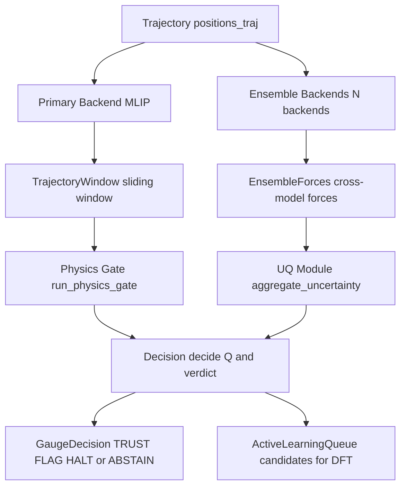

# mlipgauge

**A runtime guardrail for molecular-dynamics simulations driven by machine-learned
interatomic potentials (MLIPs).**

A universal MLIP can be confidently wrong. While a trajectory is running it can
emit forces that are not the gradient of its energy, let an NVE run's conserved
energy drift, sit at a configuration with imaginary phonons, or return an
asymmetric stress tensor. An uncertainty estimate alone will not catch these —
they are violations of physics that hold no matter how "confident" the model is.

`mlipgauge` watches a trajectory *window* and combines two signals into one
gauge value:

```
Q_traj(t) = [ ∏_k hard_gate_k(window_t) ] · (1 − u) · ∏ soft_scores
```

- a **fail-closed physics-validity gate** — four hard checks combined
  multiplicatively, so any single violation drives `Q` to 0 and the trajectory
  is halted and the offending configuration queued for active learning;
- a **calibrated cross-model uncertainty** `u ∈ [0, 1]` from disagreement across
  several MLIPs.

> **Pre-alpha (`0.1.0a2`) scope.** The physics-validity gate is the claimed
> contribution and is measured below. Calibration is a standard isotonic recipe
> and a **non-claim** layer — its numbers come from synthetic data and are
> labelled as such. Live inference with real backends and heterogeneous-UQ
> calibration are deferred to later releases. See
> [Claims and non-claims](#claims-and-non-claims).

## Architecture



## Install

```bash
pip install mlipgauge              # core (numpy / typer) + built-in mock backend
pip install "mlipgauge[mace]"      # + MACE-MP-0    (weights: MIT)
pip install "mlipgauge[chgnet]"    # + CHGNet       (weights: BSD-3-Clause)
pip install "mlipgauge[mattersim]" # + MatterSim    (weights: MIT)
```

The core install has no GPU or model-weight dependency and runs the deterministic
`mock` backend used throughout the tests. The real-backend extras pin conflicting
versions of shared dependencies (e.g. `e3nn`), so install **one** backend extra
per environment rather than several at once.

## Quickstart

```bash
mlipgauge info     # version + backend weight-license allow-list
mlipgauge demo     # deterministic mock-backend pipeline on a synthetic trajectory
```

```python
import numpy as np
from mlipgauge.backends.mock import MockBackend
from mlipgauge.gauge_api import gauge_trajectory_from_backends

# a short trajectory: (frames, atoms, 3) in Å
rng = np.random.default_rng(0)
base = rng.standard_normal((3, 3)) * 0.2
traj = np.stack([base + t * 1e-3 for t in range(8)])
z = np.array([1, 6, 8])

primary = MockBackend(k=1.5)
ensemble = [MockBackend(1.50), MockBackend(1.51), MockBackend(1.49)]

decisions, al_queue = gauge_trajectory_from_backends(
    primary, ensemble, traj, z, window_size=4
)
for d in decisions:
    print(d.verdict, round(d.Q, 3))
# configurations worth labelling with DFT next:
print(al_queue.export())
```

Each decision is `TRUST`, `FLAG`, `HALT` (a hard physics violation), or `ABSTAIN`
(uncertainty uncomputable, or no hard check could run — both fail-closed).

## How it works

The physics gate evaluates four hard checks over a trajectory window. Each is
skipped (and recorded) rather than guessed when its inputs are absent:

| check | invariant | needs |
|---|---|---|
| `energy_force_consistency` | ΔE vs −∮F·dx (non-conservative / discontinuous PES) | ≥ 2 frames |
| `nve_energy_conservation` | total (pot+kin) energy drift | kinetic energy |
| `imaginary_phonon` | min mass-weighted Hessian eigenvalue < −tol (ω² < 0), rigid translational (acoustic) modes projected out first | a Hessian + masses |
| `stress_symmetry` | ‖σ − σᵀ‖ / ‖σ‖ (spurious torque) | stress tensor |

The hard checks are combined multiplicatively (`hard_valid = ∏ 1[check passed]`),
so the gate is fail-closed: one violation is enough to reject the window. Soft
scores (continuous health in [0, 1]) down-weight near-violations without zeroing
`Q`. The physics primitives themselves are standard; what `mlipgauge` adds is the
decision layer that runs them over MD windows, normalizes per atom, projects the
rigid translational (acoustic) modes out of the Hessian before the phonon test
(so a finite-difference acoustic artefact of a stable structure is not mistaken
for an imaginary mode), skips — rather than guesses — absent inputs, and feeds
the runtime gauge and the active-learning queue.

### Decision logic

```
Q = hard_valid · (1 − u) · ∏ soft_scores
```

| condition | verdict |
|---|---|
| any hard gate fails (hard_valid = 0) | HALT |
| uncertainty uncomputable | ABSTAIN |
| all hard checks skipped (nothing to certify) | ABSTAIN |
| Q ≥ trust_threshold (default 0.7) | TRUST |
| otherwise | FLAG |

Both HALT and ABSTAIN are fail-closed: they queue the window for active learning.

> **Limitation (synthetic `0.1.0a*` scope).** Residuals and drifts are normalized
> *per atom*, which targets system-wide (extensive) violations; a single-atom
> localized discontinuity can be diluted in a very large cell. Quantifying this on
> real anharmonic MD — and adding a complementary localized (per-atom-maximum)
> threshold — is part of the deferred real-MD validation.

## Measured results

Reproduce with `python scripts/measure_gate.py` and
`python scripts/measure_calibration.py` (written to `results/`).

**Physics gate (the claim).** Constructed trajectories with ground-truth labels:
a conservative harmonic mock backend for the valid class, deliberately injected
violations for the positive class (`n = 200` each, seed 0).

| metric | value (95% bootstrap CI) |
|---|---|
| sensitivity — `energy_force_consistency` | 1.00 (1.00, 1.00) |
| sensitivity — `nve_energy_conservation` | 1.00 (1.00, 1.00) |
| sensitivity — `imaginary_phonon` | 1.00 (1.00, 1.00) |
| sensitivity — `stress_symmetry` | 1.00 (1.00, 1.00) |
| specificity on clean windows | 1.00 (1.00, 1.00) |

The gate is graded, not always-on: detection of an energy–force inconsistency as
a multiple of the tolerance is `0.0` at 0.5× and 0.9×, then `1.0` at 1.1×, 2×, 5×
— a sharp transition at the configured threshold.

The 1.00 specificity is a near-best case: the trapezoidal energy–force rule is
*exact* for the quadratic potential of the harmonic mock backend, so its clean
residual is ~0 at any step size. On a real anharmonic potential energy surface
with realistic MD step sizes the rule carries genuine truncation error, so its
false-positive behaviour there is part of the deferred real-MD validation.

**Calibration (non-claim, synthetic).** On a constructed miscalibrated score
distribution with a train/holdout split (`n = 4000`, seed 0), isotonic
calibration reduces expected calibration error from **0.132 (0.114, 0.151)** to
**0.027 (0.021, 0.049)** on the holdout. This only shows the calibration code
works on synthetic data; it is **not** a materials or MLIP capability claim.

## Claims and non-claims

**Claimed in `0.1.0a2`:** the physics-validity gate detects the four injected
hard violations and passes valid windows on the constructed trajectories above,
with a graded threshold response.

**Not claimed in `0.1.0a2`:**

- calibration quality on real data — the calibration numbers are synthetic and
  labelled as such;
- a novel uncertainty estimator — cross-model force disagreement is a standard
  signal, and only one uncertainty type is wired in;
- live inference with real backends — the MACE / CHGNet / MatterSim wrappers are
  real ASE-calculator code but are not exercised in CI (no GPU, no weights), so
  treat them as unverified until a later release;
- heterogeneous-UQ calibration and a production active-learning loop — deferred.

## Backends and licenses

`mlipgauge` ships **no model weights**. Real backends are optional extras and
their weights carry their own licenses, listed in the package. A runtime
allow-list refuses, fail-closed, to load a backend whose declared weight license
is not commercially usable. MACE-OMAT-0 (ASL, non-commercial) is therefore not
loadable by default; a caller must opt its license in explicitly.

## Development

```bash
pip install -e ".[dev]"
pytest                                  # full suite, GPU-free
python scripts/verify_step.py S2        # stage gate self-checks
```

## License

MIT. See [LICENSE](LICENSE).
